<h1>Hi There, I am Mohan </h1>

My passion lies in the realm of cutting-edge technologies such as Machine Learning, Deep Learning, and Data Science. I'm currently working as a NLP Engineer at <a href="https://textify.ai/">Textify AI</a>

- 📚 I’m currently working with LLMs.
- 🤝 Open for collaboration in <b>NLP</b> and <b>Computer Vision</b>.
- 🕸️ Visit my porfolio [website](https://mohan-gupta.github.io/) for more info.
- 📫 Contact me: mohankrishnagupta@gmail.com

<h3>Skills</h3>
<h4>Preferred Languages</h4>

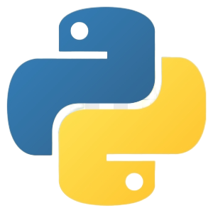&nbsp&nbsp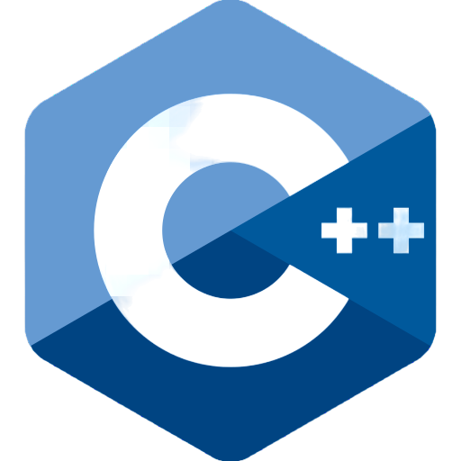

<h4>Databases</h4>

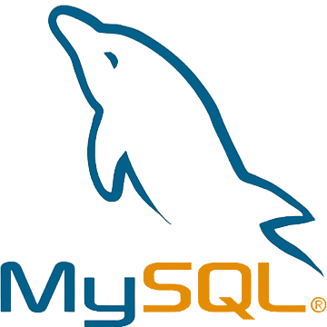&nbsp&nbsp

<h4>Data Processing and Visualization</h4>

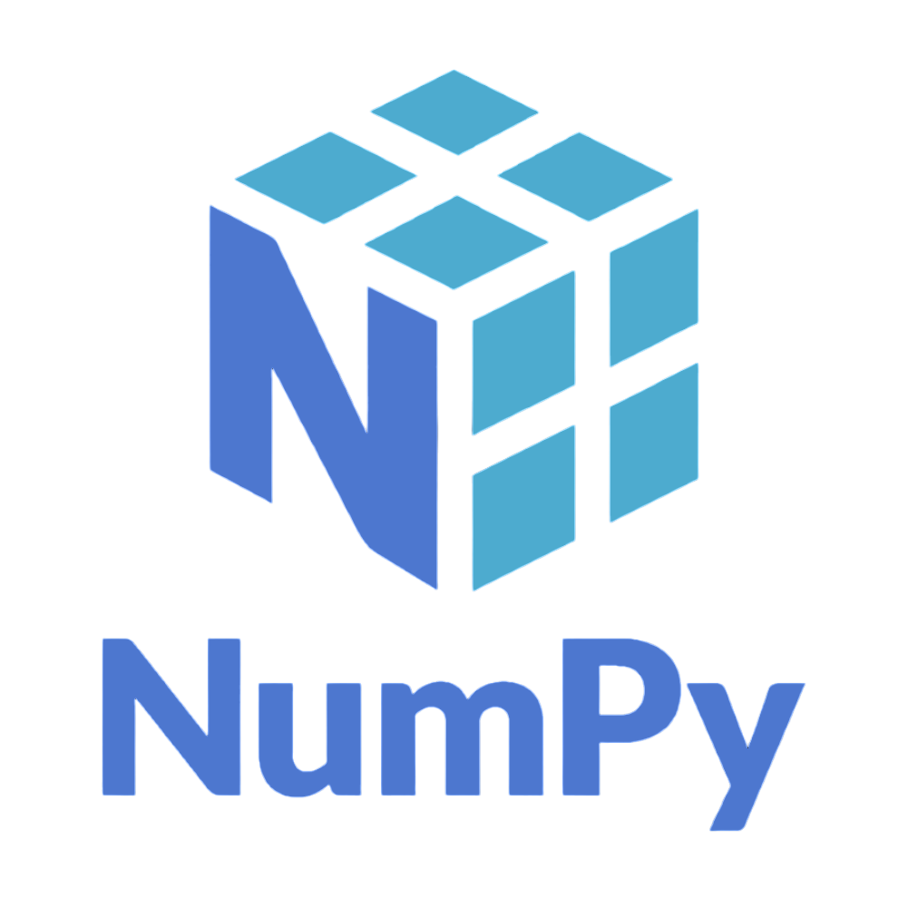&nbsp&nbsp&nbsp&nbsp&nbsp&nbsp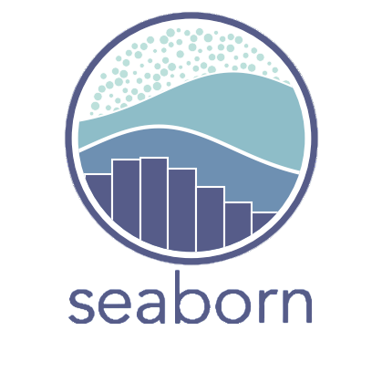&nbsp&nbsp

<h4>ML/DL</h4>

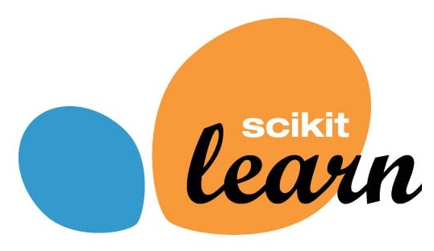&nbsp&nbsp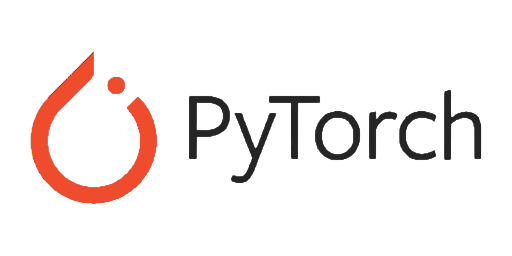&nbsp&nbsp&nbsp&nbsp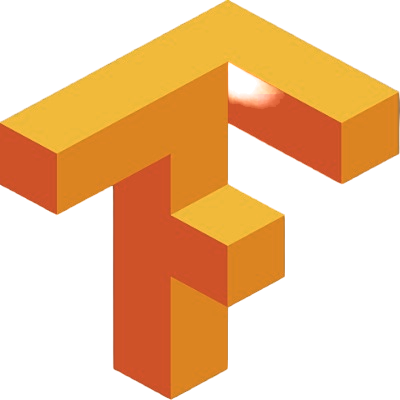&nbsp&nbsp&nbsp&nbsp&nbsp&nbsp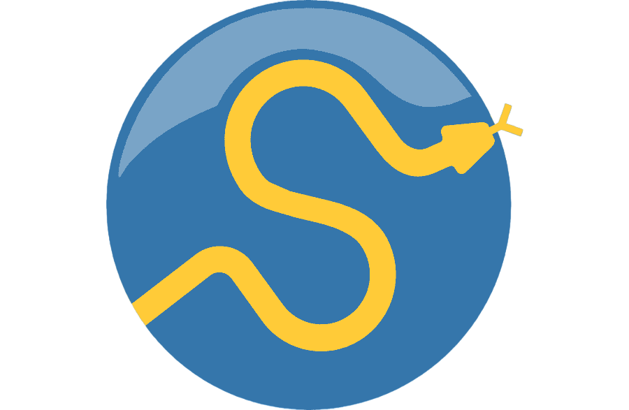

<h4>Backend</h4>

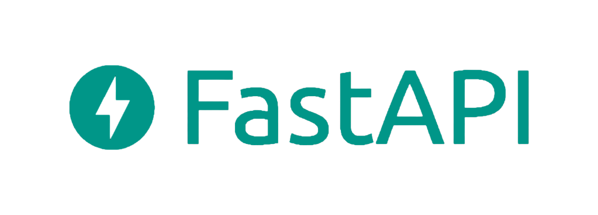&nbsp&nbsp

<h4>Web Scrapping</h4>

&nbsp&nbsp

<h4>Tools and IDEs</h4>

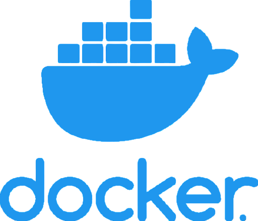&nbsp&nbsp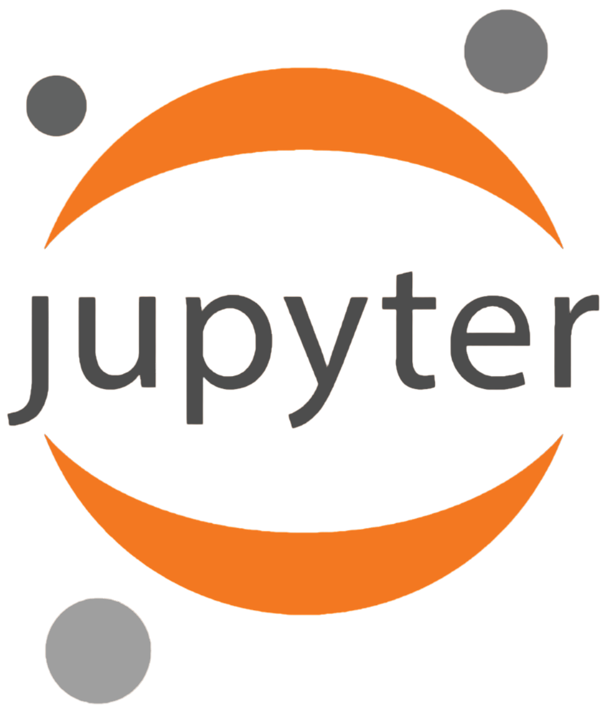&nbsp&nbsp&nbsp&nbsp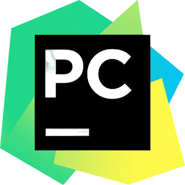

<h3>Recent Posts</h3>
<ul>
<li><a href = "https://medium.com/@mohan-gupta/running-llms-on-cpu-1455356b1b47">Running LLMs on CPU</a></li>
<li><a href = "https://medium.com/@mohan-gupta/python-best-practices-4ad47c81b9bc">Python Best Practices</a></li>
<li><a href = "https://medium.com/@mohan-gupta/descriptive-statistics-all-the-fundamentals-you-need-to-know-about-a9ce84697367">Descriptive Statistics — All the fundamentals you need to know.</a></li>
<li><a href = "https://medium.com/@mohan-gupta/understanding-variance-and-why-do-we-divide-by-n-1-58950c0953a4">Understanding Variance and Why do we divide by n-1?</a></li>
</ul>